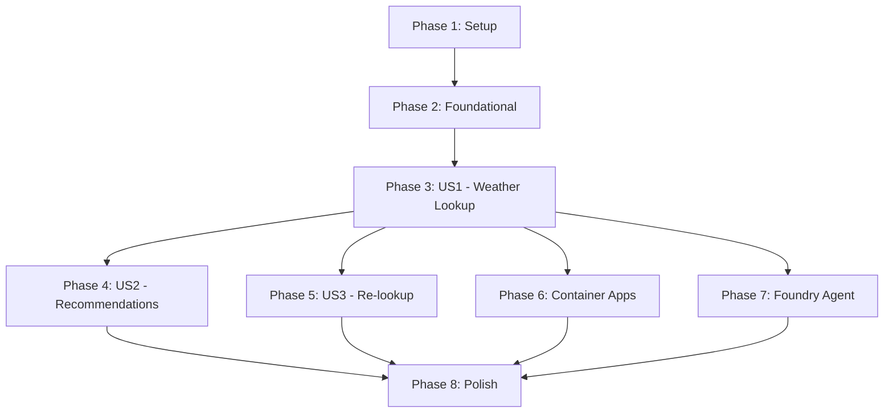

# Tasks: Weather-Based Clothing Advisor

**Input**: Design documents from `/specs/001-weather-clothing-advisor/`

**Prerequisites**: plan.md ✅, spec.md ✅, research.md ✅, data-model.md ✅, contracts/ ✅, quickstart.md ✅

**Tests**: Manual testing only per POC Constitution Principle III - No automated test tasks included

**Organization**: Tasks are grouped by user story to enable independent implementation and testing of each story. Dual deployment demonstration is core to this POC.

## Format: `[ID] [P?] [Story] Description`

- **[P]**: Can run in parallel (different files, no dependencies)
- **[Story]**: Which user story this task belongs to (e.g., US1, US2, US3)
- Include exact file paths in descriptions

---

## Phase 1: Setup (Shared Infrastructure)

**Purpose**: Project initialization and basic structure for multi-component architecture

- [ ] T001 Initialize uv project with pyproject.toml at repository root
- [ ] T002 [P] Create root directory structure: src/, tests/manual/, specs/
- [ ] T003 [P] Create .env.example with OpenWeatherMap API key, Azure resource placeholders
- [ ] T004 [P] Create README.md with project overview, setup instructions, deployment links

---

## Phase 2: Foundational (Blocking Prerequisites)

**Purpose**: Core shared infrastructure that MUST be complete before ANY user story can be implemented

**⚠️ CRITICAL**: No user story work can begin until this phase is complete - the weather API blocks all agent work

### Shared Code (Required by All Components)

- [ ] T005 [P] Create src/shared/models.py with Location, WeatherData, ClothingItem, ClothingRecommendation, WeatherApiError dataclasses
- [ ] T006 [P] Create src/shared/constants.py with temperature ranges, clothing categories, API configuration constants

### Weather API Service (Blocks US1, US2, US3)

- [ ] T007 Create src/weather-api/ directory structure per plan.md
- [ ] T008 Create src/weather-api/app.py with FastAPI endpoint for get_weather tool
- [ ] T009 Create src/weather-api/weather_service.py with OpenWeatherMap API client class
- [ ] T010 Generate src/weather-api/requirements.txt from pyproject.toml using uv
- [ ] T011 Create src/weather-api/.env.example with OPENWEATHERMAP_API_KEY

**Checkpoint**: Foundation ready - weather API must be testable before proceeding to user stories

---

## Phase 3: User Story 1 - Basic Weather Lookup (Priority: P1) 🎯 MVP

**Goal**: User can enter zip code and receive current weather information (temperature, conditions, humidity, wind)

**Independent Test**: Enter valid zip code 10001, verify weather data displays within 5 seconds per SC-001

### Implementation for User Story 1

- [ ] T013 [P] [US1] Create src/agent-container/ directory structure per plan.md
- [ ] T014 [P] [US1] Create src/agent-foundry/ directory structure per plan.md
- [ ] T015 [P] [US1] Create src/agent-container/app.py as agent entry point with FastAPI server
- [ ] T016 [P] [US1] Create src/agent-foundry/register_agent.py for Foundry agent registration
- [ ] T017 [US1] Implement src/agent-container/agent_service.py to initialize ChatAgent with get_weather tool registration
- [ ] T018 [US1] Implement src/agent-foundry/agent_config.py to configure AzureAIAgentClient with get_weather tool
- [ ] T019 [US1] Load agent instructions from contracts/agent-prompts.md in both agent implementations
- [ ] T020 [US1] Implement basic request handler in src/agent-container/app.py for zip code input
- [ ] T020a [US1] Configure HTTP request timeouts for weather API calls (3 sec per spec performance goal)
- [ ] T020b [US1] Add response time logging for SC-001 validation (<5 sec end-to-end)
- [ ] T021 [US1] Implement agent invocation logic to call get_weather tool and display weather data
- [ ] T022 [P] [US1] Create src/agent-container/.env.example with agent configuration variables
- [ ] T023 [P] [US1] Create src/agent-foundry/.env.example with Foundry endpoint, credentials

**Checkpoint**: At this point, both agent deployments should successfully retrieve and display weather data for valid zip codes

---

## Phase 4: User Story 2 - Clothing Recommendations (Priority: P2)

**Goal**: After viewing weather, user receives 3-5 specific clothing recommendations based on temperature, precipitation, and wind

**Independent Test**: Enter any zip code, verify agent provides appropriate recommendations per temperature classification from agent-prompts.md

### Implementation for User Story 2

- [ ] T024 [P] [US2] Create src/agent-container/clothing_logic.py with recommendation generation functions
- [ ] T025 [US2] Implement temperature classification function (5 ranges: <32°F, 32-50°F, 50-70°F, 70-85°F, >85°F)
- [ ] T026 [US2] Implement precipitation handling function (rain, snow detection and gear addition)
- [ ] T027 [US2] Implement wind condition handling function (>15 mph threshold)
- [ ] T028 [US2] Implement recommendation formatting function (organize by category: outerwear, layers, accessories, footwear)
- [ ] T029 [US2] Integrate clothing_logic.py into src/agent-container/agent_service.py agent response processing
- [ ] T030 [US2] Copy clothing_logic.py to src/agent-foundry/clothing_logic.py (code reuse per plan.md)
- [ ] T031 [US2] Update agent instructions in both deployments to enforce SC-002 (3-5 recommendations minimum)
- [ ] T032 [US2] Verify recommendations follow SC-004 (understandable language, clear reasons)

**Checkpoint**: At this point, both deployments should provide temperature-appropriate, organized clothing recommendations with reasoning

---

## Phase 5: User Story 3 - Quick Re-lookup (Priority: P3)

**Goal**: User can perform multiple lookups in a single session without errors or stale data

**Independent Test**: Enter zip 10001, then 90210, then 60601 - verify each shows fresh weather data and different recommendations per FR-009

### Implementation for User Story 3

- [ ] T033 [US3] Implement session state management in src/agent-container/app.py to clear previous results
- [ ] T034 [US3] Add thread management in src/agent-foundry/agent_config.py for multi-turn conversations
- [ ] T035 [US3] Verify get_weather tool calls fetch fresh data (no caching per POC requirements)
- [ ] T036 [US3] Add error recovery logic in both agents to handle invalid-then-valid zip code sequences
- [ ] T037 [US3] Test consecutive identical zip code lookups to verify fresh fetches

**Checkpoint**: All user stories should now be independently functional - agents support multiple lookups with fresh data

---

## Phase 6: Deployment Configuration - Container Apps

**Purpose**: Enable deployment demonstration for Container Apps hosting pattern

- [ ] T038 Create src/agent-container/Dockerfile with Python 3.11 base image and uv installation
- [ ] T039 Generate src/agent-container/requirements.txt from pyproject.toml using uv
- [ ] T040 [P] Create src/deployments/container-app/ directory structure per plan.md
- [ ] T041 [P] Create src/deployments/container-app/README.md with deployment walkthrough
- [ ] T042 Create src/deployments/container-app/deploy.sh with deployment commands for Container Apps + Weather API
- [ ] T043 Create src/deployments/container-app/bicep/monitoring.bicep for Application Insights resource
- [ ] T045 Create src/deployments/container-app/bicep/container-app.bicep for Container Apps resources
- [ ] T046 Create src/deployments/container-app/bicep/main.bicep to orchestrate all resources in Sweden Central
- [ ] T047 Implement src/agent-container/telemetry.py with azure-monitor-opentelemetry integration
- [ ] T048 Add telemetry instrumentation to src/agent-container/app.py with custom dimensions (deployment_type: container-app)
- [ ] T049 Configure environment variables in deploy.sh for APPLICATIONINSIGHTS_CONNECTION_STRING

**Checkpoint**: Container Apps deployment should be executable via deploy.sh script

---

## Phase 7: Deployment Configuration - Foundry Agent Service

**Purpose**: Enable deployment demonstration for managed Azure AI Foundry hosting pattern

- [ ] T050 [P] Create src/deployments/foundry-agent/ directory structure per plan.md
- [ ] T051 [P] Create src/deployments/foundry-agent/README.md with registration and deployment walkthrough
- [ ] T052 Generate src/agent-foundry/requirements.txt from pyproject.toml using uv
- [ ] T053 Create src/deployments/foundry-agent/deploy.sh with agent registration commands
- [ ] T054 Create src/deployments/foundry-agent/bicep/monitoring.bicep for Application Insights resource (shared)
- [ ] T056 Create src/deployments/foundry-agent/bicep/ai-foundry.bicep for Azure AI Foundry workspace and project
- [ ] T057 Create src/deployments/foundry-agent/bicep/main.bicep to orchestrate all resources in Sweden Central
- [ ] T058 Implement agent registration logic in src/agent-foundry/register_agent.py with tool and instruction upload
- [ ] T059 Configure agent with Application Insights connection for native Foundry telemetry
- [ ] T060 Add custom dimensions in agent config (deployment_type: foundry-agent) for telemetry correlation

**Checkpoint**: Foundry Agent deployment should be executable via register_agent.py and deploy.sh

---

## Phase 8: Polish & Cross-Cutting Concerns

**Purpose**: Improvements that affect multiple user stories and deployment readiness

- [ ] T061 [P] Validate all environment variable examples in .env.example files are documented
- [ ] T062 [P] Add error handling for FR-007 (invalid zip codes) with user-friendly messages in both agents
- [ ] T063 [P] Add error handling for FR-008 (API failures) with graceful degradation in both agents
- [ ] T064 Verify SC-001 (response time <5 seconds) by testing cold starts and typical requests
- [ ] T065 Verify SC-002 (3-5 recommendations) across temperature ranges
- [ ] T066 Verify SC-004 (understandable recommendations) with sample output review
- [ ] T067 Verify SC-005 (extreme conditions) by testing edge case zip codes from quickstart.md
- [ ] T068 [P] Create tests/manual/test_weather_api.py with direct Weather API invocation examples
- [ ] T069 [P] Create tests/manual/test_agent.py with agent conversation test scenarios
- [ ] T070 Update root README.md with architecture diagram links and quickstart reference
- [ ] T071 Run through quickstart.md validation for Container Apps deployment
- [ ] T072 Run through quickstart.md validation for Foundry Agent deployment
- [ ] T073 Validate telemetry visibility in Application Insights for both deployments per quickstart.md telemetry section
- [ ] T074 Create demo script or slides based on quickstart.md demo section
- [ ] T075 Code cleanup: ensure clothing_logic.py is identical in both agent directories (symlink or build-time copy)

---

## Dependencies & Execution Order

### Phase Dependencies

- **Phase 1 (Setup)**: No dependencies - can start immediately
- **Phase 2 (Foundational)**: Depends on Phase 1 completion - BLOCKS all user stories
   - ⚠️ **Weather API (T007-T011) is critical path** - must work before agents can be built
- **Phase 3 (US1)**: Depends on Phase 2 completion - Basic weather lookup enables all future work
- **Phase 4 (US2)**: Depends on Phase 3 completion - Recommendations build on weather lookup
- **Phase 5 (US3)**: Depends on Phase 3 completion (independent of US2 - could parallelize)
- **Phase 6 (Container Apps)**: Depends on Phase 3 completion minimum (MVP), ideally Phase 5
- **Phase 7 (Foundry Agent)**: Depends on Phase 3 completion minimum (MVP), ideally Phase 5
- **Phase 8 (Polish)**: Depends on all desired user stories and at least one deployment being complete

### User Story Dependencies



- **US1 (Basic Weather Lookup)**: Foundation for everything - must complete first
- **US2 (Clothing Recommendations)**: Depends on US1 (needs weather data to generate recommendations)
- **US3 (Quick Re-lookup)**: Depends on US1 (needs basic lookup working, independent of US2)
- **US2 and US3**: Can be worked on in parallel after US1 is complete

### Within Each User Story

**User Story 1 (Weather Lookup)**:

1. T013-T016: Directory setup (parallel)
2. T017-T018: Agent initialization (parallel after directory setup)
3. T019: Load instructions (depends on agent init)
4. T020-T021: Request handling and tool invocation (sequential after T019)
5. T022-T023: Environment configuration (parallel, can happen anytime)

**User Story 2 (Recommendations)**:

1. T024: Create clothing_logic.py (first)
2. T025-T028: Implement logic functions (parallel after T024)
3. T029-T030: Integrate into agents (sequential after logic functions)
4. T031-T032: Verification tasks (after integration)

**User Story 3 (Re-lookup)**:

1. T033-T034: State management (parallel)
2. T035-T037: Testing and verification (sequential after state management)

### Parallel Opportunities

**Maximum Parallelization Scenario** (with sufficient team capacity):

1. **After Phase 1**: All Phase 2 tasks T005-T006 (shared code) can run while T007-T011 (weather API) progresses
2. **After Phase 2**:
   - T013-T014 (directory setup)
   - T015-T016 (agent scaffolding)
   - Can start in parallel
3. **After US1 Complete**:
   - Phase 4 (US2 - Recommendations)
   - Phase 5 (US3 - Re-lookup)
   - Phase 6 (Container Apps deployment config)
   - Phase 7 (Foundry Agent deployment config)
   - Can all progress in parallel if team capacity allows
4. **Within Deployment Phases**:
   - Bicep files (T043-T045, T054-T057) can be written in parallel
   - Documentation (T041, T051) can be written in parallel with implementation

---

## Parallel Example: After Foundational Phase Complete

Once Phase 2 is complete, the following work streams can proceed simultaneously:

```bash
# Developer 1: User Story 1 - Weather Lookup (Container Apps)
T013-T023  # Container Apps agent implementation

# Developer 2: User Story 1 - Weather Lookup (Foundry Agent)
T014-T023  # Foundry agent implementation (overlapping task numbers, different files)

# Developer 3: Preparing for US2
T024-T028  # Clothing logic functions (can start once US1 agent structure is defined)
```

Once US1 is verified working:

```bash
# Developer 1: User Story 2 - Recommendations
T029-T032  # Integrate clothing logic

# Developer 2: User Story 3 - Re-lookup
T033-T037  # Multi-lookup support

# Developer 3: Container Apps Deployment
T038-T049  # Docker, Bicep, telemetry

# Developer 4: Foundry Deployment
T050-T060  # Registration, Bicep, telemetry
```

---

## Implementation Strategy

### MVP Scope (Recommended First Milestone)

**Goal**: Demonstrate one working deployment with core functionality

**Minimum Viable POC**:
- Phase 1: Setup ✅
- Phase 2: Foundational (Weather API) ✅
- Phase 3: User Story 1 (Weather Lookup) ✅
- Phase 6: Container Apps Deployment (choose one deployment first) ✅

**Why This MVP**: Demonstrates the core value proposition with one complete deployment path. User can enter zip code and get weather data via a deployed agent calling the Weather API.

**Timeline Estimate**: ~2-3 days for single developer

### Full POC Scope

**Goal**: Demonstrate dual deployment with all user stories

**Complete POC**:
- Phase 1-3: Setup through US1 ✅
- Phase 4: User Story 2 (Clothing Recommendations) ✅
- Phase 5: User Story 3 (Re-lookup) ✅
- Phase 6: Container Apps Deployment ✅
- Phase 7: Foundry Agent Deployment ✅
- Phase 8: Polish & Validation ✅

**Timeline Estimate**: ~4-6 days for single developer, ~2-3 days with 2 developers working in parallel

### Critical Path

The fastest path to a working demo:

```
Setup (T001-T004)
  → Shared Models (T005-T006)
   → Weather API (T007-T011) ⚠️ CRITICAL
  → Container Agent Basic (T013-T023)
  → Container Deployment (T038-T049)
  → Manual Testing per quickstart.md
```

**Estimated Critical Path Duration**: ~2 days (assuming no blockers)

---

## Task Count Summary

- **Phase 1 (Setup)**: 4 tasks
- **Phase 2 (Foundational)**: 8 tasks ⚠️ **Blocking Phase**
- **Phase 3 (US1 - Weather Lookup)**: 13 tasks 🎯 **MVP Core** (includes T020a, T020b for timeout/performance)
- **Phase 4 (US2 - Recommendations)**: 9 tasks
- **Phase 5 (US3 - Re-lookup)**: 5 tasks
- **Phase 6 (Container Apps Deployment)**: 12 tasks
- **Phase 7 (Foundry Agent Deployment)**: 11 tasks
- **Phase 8 (Polish)**: 15 tasks

**Total Tasks**: 77 tasks (updated from 75 - added T020a, T020b)

**Parallelizable Tasks**: 27 tasks marked with [P] (35%)

**Story Distribution**:
- US1 (P1): 13 tasks (includes timeout configuration T020a, T020b)
- US2 (P2): 9 tasks
- US3 (P3): 5 tasks
- Infrastructure: 50 tasks (Setup, Foundational, Deployments, Polish)

---

## Validation Checkpoints

After each phase, validate against quickstart.md:

**After Phase 2 (Foundational)**:
- [ ] Weather API returns valid WeatherData JSON for zip 10001
- [ ] Weather API handles invalid zip 00000 with proper error response

**After Phase 3 (US1 - Weather Lookup)**:
- [ ] Agent displays temperature, conditions, humidity, wind speed
- [ ] Response time <5 seconds per SC-001
- [ ] Invalid zip codes show user-friendly errors per FR-007

**After Phase 4 (US2 - Recommendations)**:
- [ ] Agent provides 3-5 recommendations per SC-002
- [ ] Recommendations appropriate for temperature classification
- [ ] Precipitation handling includes rain/snow gear per FR-006
- [ ] Understandable language per SC-004

**After Phase 5 (US3 - Re-lookup)**:
- [ ] Multiple consecutive lookups work without errors per FR-009
- [ ] Each lookup fetches fresh weather data

**After Phase 6 (Container Apps)**:
- [ ] Deployed agent accessible via public URL
- [ ] Telemetry visible in Application Insights
- [ ] Custom dimensions distinguish deployment_type

**After Phase 7 (Foundry Agent)**:
- [ ] Agent registered in Azure AI Foundry portal
- [ ] Agent threads visible in Foundry dashboard
- [ ] Tool calls tracked in telemetry

**After Phase 8 (Polish)**:
- [ ] All success criteria SC-001 through SC-005 verified
- [ ] Demo script rehearsed successfully
- [ ] Both deployments produce identical recommendations for same zip code
